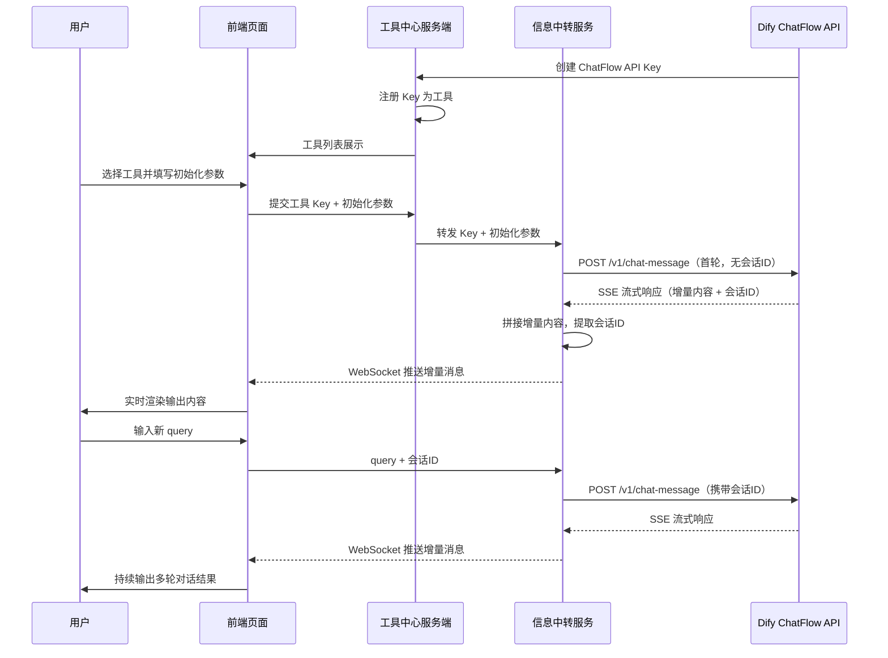

```mermaid
sequenceDiagram
    participant U as 用户
    participant FE as 前端页面
    participant TC as 工具中心服务端
    participant TS as 信息中转服务
    participant DF as Dify ChatFlow API

    %% 工具准备阶段
    DF->>TC: 创建 ChatFlow API Key
    TC->>TC: 注册 Key 为工具
    TC->>FE: 工具列表展示

    %% 首轮对话
    U->>FE: 选择工具并填写初始化参数
    FE->>TC: 提交工具 Key + 初始化参数
    TC->>TS: 转发 Key + 初始化参数
    TS->>DF: POST /v1/chat-message（首轮，无会话ID）

    %% 流式响应
    DF-->>TS: SSE 流式响应（增量内容 + 会话ID）
    TS->>TS: 拼接增量内容，提取会话ID
    TS-->>FE: WebSocket 推送增量消息
    FE->>U: 实时渲染输出内容

    %% 多轮对话
    U->>FE: 输入新 query
    FE->>TS: query + 会话ID
    TS->>DF: POST /v1/chat-message（携带会话ID）
    DF-->>TS: SSE 流式响应
    TS-->>FE: WebSocket 推送增量消息
    FE->>U: 持续输出多轮对话结果

```
