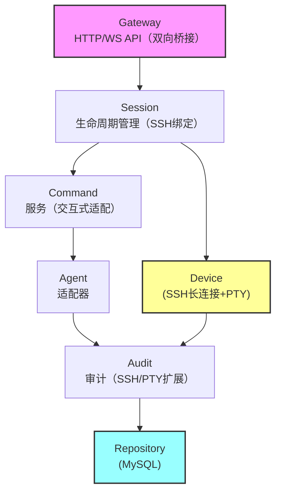
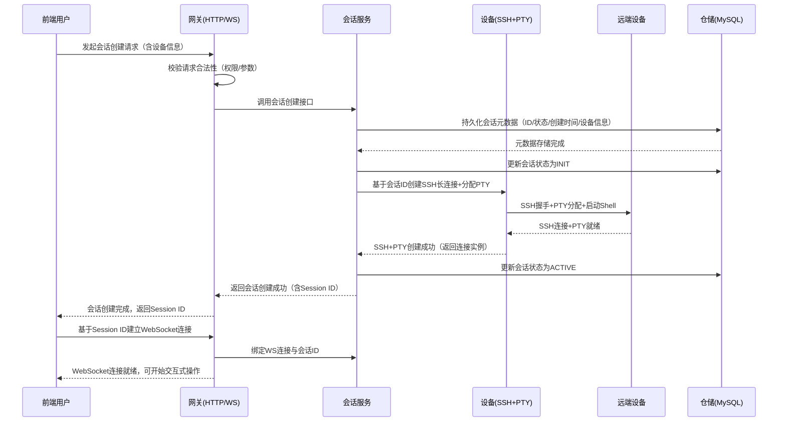
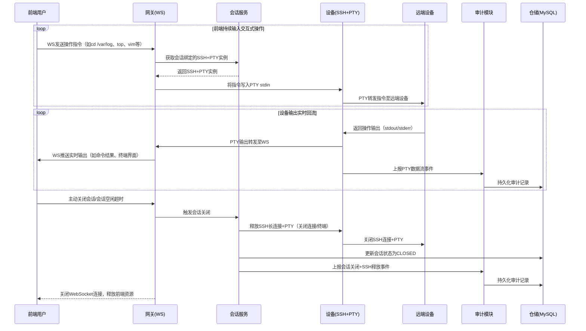
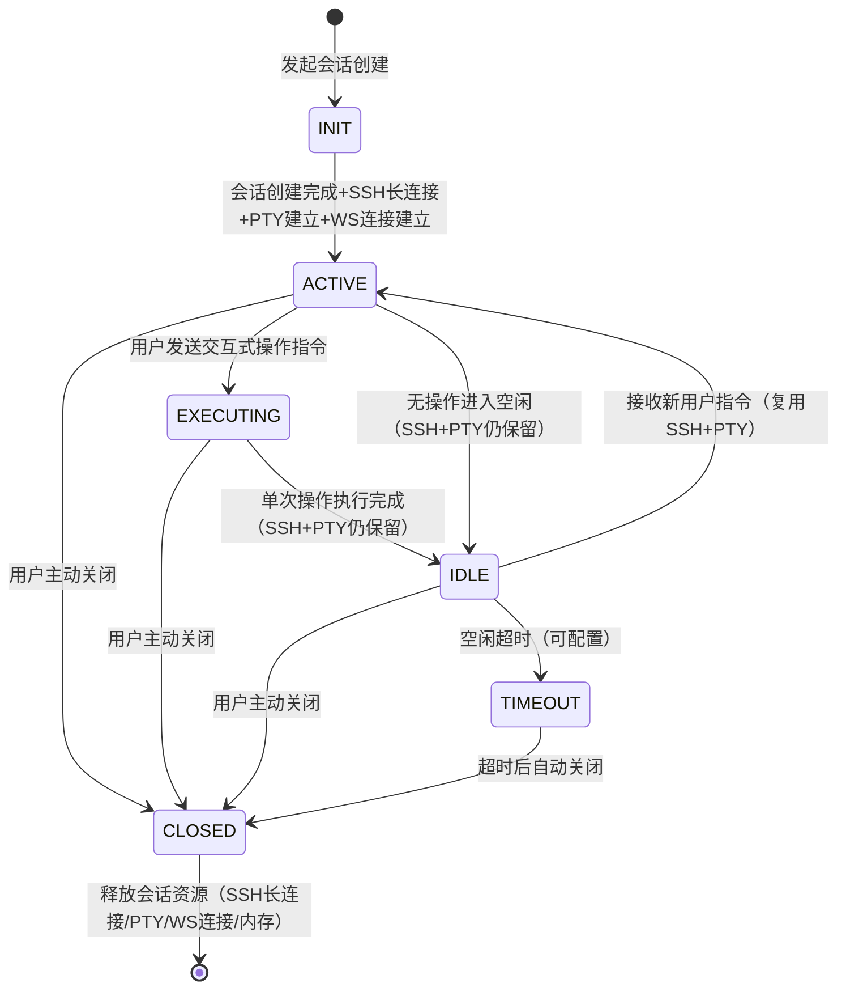

# AI Ops 网页终端 - 服务架构设计文档

版本：2.0
更新时间：2026-01-25 16:00:00

---

## 1. 项目愿景

该系统定位为AI辅助的DevOps（AI Ops）平台，核心目标是降低运维工作量，同时通过服务端中间层屏蔽前端与被操作设备的直接关联，实现Web端对远端设备的交互式操作能力，具体通过以下能力实现：

- 支持AI智能体（AI Agent）基于只读命令完成诊断推理；
- 会话生命周期内维持与远端设备的SSH长连接并复用PTY伪终端，支持交互式运维操作；
- 前端WebSocket与服务端PTY双向实时同步数据流，实现Web端对远端设备的沉浸式操作体验；
- 向运维人员返回结构化/实时流式的执行结果；
- 全流程保留操作痕迹，确保可追溯性。

**核心指标**：支持数百个并发SSH长连接会话，会话内PTY伪终端复用无性能损耗
**架构策略**：先落地模块化单体架构，预留演进为微服务架构的路径

本文档聚焦于交付“生产就绪”的初始版本，同时明确模块边界与长期演进路径，核心适配“会话级SSH长连接+PTY交互式操作”的核心诉求。

---

## 2. 核心架构原则

1. 模块边界清晰（为未来服务拆分预留接口，无侵入拆分）；
2. 接口驱动设计（仓储层、网关层抽象解耦）；
3. 依赖注入（基于Kratos框架实现）；
4. 会话生命周期隔离（避免跨会话资源竞争，SSH长连接/PTY与会话强绑定）；
5. 可观测性就绪（预置链路追踪、指标监控埋点，新增SSH连接/PTY数据流监控）；
6. 最小可行生产架构（安全加固分阶段迭代）。

---

## 3. 核心模块结构

```
/cmd
    /server          // 服务启动入口
/internal
    /gateway         // HTTP + WebSocket 接入层（外部唯一入口，新增WS与PTY双向桥接）
    /session         // 会话生命周期管理（内存态+持久态，新增SSH长连接/PTY生命周期绑定）
    /device          // SSH客户端网关（核心改造：SSH长连接封装+PTY伪终端管理）
    /command         // 命令流水线（校验/排队/执行协调，适配交互式命令流转）
    /agent           // AI智能体适配器（对接AI推理引擎）
    /audit           // 审计事件记录（操作/执行/异常事件，新增SSH连接/PTY操作审计）
    /auth            // 认证&RBAC（预留模块）
    /data
        /repository  // 存储接口层（抽象存储能力）
        /mysql       // MySQL存储实现（会话/审计/命令数据）
    /telemetry       // 链路追踪&指标监控（新增SSH连接时长、PTY数据流等指标）
/api                  // Protobuf协议定义（微服务演进边界）
```

### 3.1 核心模块能力调整说明

| 模块      | 新增/调整核心能力                                                                                                                     |
| --------- | ------------------------------------------------------------------------------------------------------------------------------------- |
| Device    | 1. 封装会话级SSH长连接，替代原“单命令单次连接”；2. 实现PTY伪终端分配/管理/数据流转发；3. 提供SSH连接/PTY的生命周期管控（创建/释放） |
| Session   | 1. 会话状态流转关联SSH长连接/PTY的创建/释放；2. 缓存会话ID与SSH长连接实例的映射关系；3. 基于Context管控会话+SSH连接的超时/取消        |
| Gateway   | 1. 强化WebSocket双向通信能力，实现“前端输入→PTY stdin”“PTY stdout/stderr→前端”的实时转发；2. 桥接WS与Device模块的PTY数据流      |
| Audit     | 新增SSH连接建立/释放、PTY操作、WS数据流等审计维度                                                                                     |
| Telemetry | 新增SSH长连接数、PTY数据流吞吐量、连接异常率、会话空闲超时率等监控指标                                                                |

---

## 4. 模块依赖关系

### 4.1 依赖关系图（Mermaid）



### 4.2 依赖关系说明

- 网关（Gateway）是唯一外部入口，所有请求均通过该模块接入，新增WS与PTY的双向数据流桥接能力；
- 会话（Session）模块主导生命周期管理，维护内存中的会话状态，同时绑定SSH长连接/PTY的生命周期；
- 命令（Command）模块负责命令的校验、排队与执行协调，适配交互式命令的流转逻辑（不再局限于单条只读命令）；
- 设备（Device）模块封装SSH长连接+PTY伪终端能力，处理与目标机器的交互式SSH通信，是本次改造的核心模块；
- 智能体（Agent）模块对接AI推理引擎，生成诊断命令，命令执行复用会话内的SSH长连接；
- 审计（Audit）模块统一持久化系统事件，新增SSH连接/PTY操作、WS数据流等审计维度；
- 仓储（Repository）层抽象存储逻辑，底层基于MySQL实现（可扩展其他存储）。

该结构支持后续将Session、Command、Agent等模块无侵入拆分为独立微服务，仅需将SSH连接状态缓存扩展至分布式存储（如Redis）即可。

---

## 5. 核心系统交互时序图

### 5.1 会话创建+SSH长连接建立流程



### 5.2 交互式操作执行流程（复用SSH长连接）



---

## 6. 会话生命周期模型

### 6.1 状态流转图（Mermaid）



### 6.2 状态说明（新增SSH+PTY关联逻辑）

| 状态      | 描述                                                   | SSH+PTY状态                   |
| --------- | ------------------------------------------------------ | ----------------------------- |
| INIT      | 初始化中（会话元数据正在创建/持久化，准备建立SSH连接） | 待创建                        |
| ACTIVE    | 活跃态（WS已连接，SSH长连接+PTY就绪，可接收指令）      | 已建立，处于就绪状态          |
| EXECUTING | 执行中（交互式指令正在PTY→SSH通道执行）               | 已建立，数据流实时传输        |
| IDLE      | 空闲态（无指令执行，等待用户操作）                     | 已建立，保持连接等待复用      |
| CLOSED    | 关闭态（用户主动/超时关闭，资源已释放）                | 已释放（SSH连接关闭+PTY终止） |
| TIMEOUT   | 超时态（空闲超时触发，最终转为CLOSED）                 | 待释放                        |

### 6.3 并发模型（强化SSH+PTY隔离）

- 每个会话绑定独立goroutine + 独立SSH长连接 + 独立PTY伪终端，避免跨会话资源竞争；
- 基于Context实现会话+SSH连接+PTY的统一取消/超时控制；
- 内置空闲超时检测（可配置超时阈值，默认30分钟），超时后自动释放SSH+PTY资源；
- 限制单实例最大SSH长连接数（默认500），避免资源耗尽。

---

## 7. 最小可用生产版本范围

### 7.1 V1版本包含能力（适配新需求）

- 模块化单体架构（预留微服务拆分接口）；
- MySQL持久化（会话/审计/命令/SSH连接日志数据）；
- SSH长连接+PTY伪终端管理，支持会话内连接复用；
- WebSocket与PTY双向实时数据流同步，支持交互式操作（如cd、top、vim等）；
- AI诊断命令生成与确认执行（复用SSH长连接）；
- 基础可观测性（链路追踪/指标埋点，含SSH连接/PTY数据流监控）；
- 全流程审计（操作/执行/SSH连接/PTY操作留痕）。

### 7.2 延后至后续版本的能力

- 高级安全策略（命令黑白名单/IP白名单/PTY操作权限管控）；
- 多租户隔离；
- 分布式会话路由+Redis缓存SSH连接状态；
- SSH连接池优化（预创建/复用连接）；
- 高级合规管控（操作审批/留痕校验）；
- PTY终端大小动态调整。

---

## 8. 演进路线图

| 阶段  | 核心目标                                            | 关键动作                                                                                      |
| ----- | --------------------------------------------------- | --------------------------------------------------------------------------------------------- |
| 阶段1 | 稳定的模块化单体架构（支持SSH长连接+PTY交互式操作） | 完成V1版本开发、测试、生产落地；实现核心模块改造（Device/Session/Gateway）；接入基础监控/审计 |
| 阶段2 | 水平扩展                                            | 网关层改为无状态 + 会话粘性路由；SSH连接状态缓存至Redis；优化并发连接管控                     |
| 阶段3 | 拆分会话服务                                        | 将Session模块拆分为独立微服务；实现分布式会话管理+SSH连接状态同步                             |
| 阶段4 | 拆分命令/智能体服务                                 | 将Command、Agent模块拆分为独立微服务；扩展PTY高级能力（终端大小调整、多窗口）                 |
| 阶段5 | 全链路高可用                                        | 实现SSH连接故障自动重连；PTY会话灾备；多实例负载均衡                                          |

---

## 9. 部署建议

- 部署形态：容器化部署（Docker镜像）；
- 编排平台：适配Kubernetes（提供Deployment/Service配置）；
- 存储：
  - 主数据库：MySQL（存储核心业务数据：会话、审计、命令）；
  - 缓存（必选）：Redis（缓存会话ID与SSH连接实例映射、会话状态）；
- 监控：Prometheus + Grafana（监控指标：SSH长连接数、PTY数据流吞吐量、连接异常率、会话超时率、WS连接数）；
- 资源配置：单实例建议CPU ≥ 2核，内存 ≥ 4G（支撑500并发SSH长连接）。

---

## 10. 核心设计补充（SSH+PTY关键实现）

### 10.1 SSH长连接+PTY核心封装逻辑

Device模块核心封装 `SSHSession`结构体，实现会话级SSH连接+PTY的生命周期管理，关键能力：

- 绑定会话ID，确保连接与会话生命周期强绑定；
- 支持PTY伪终端的分配、Shell启动、数据流（stdin/stdout/stderr）转发；
- 基于Context实现连接的超时/取消控制；
- 提供连接释放、异常回收的兜底逻辑。

### 0.2 双向数据流同步逻辑

Gateway模块通过WebSocket实现前端与PTY的双向同步：

- 前端输入（文本/二进制）→ WS → PTY stdin → 远端设备；
- 远端设备输出 → PTY stdout/stderr → WS → 前端实时展示；
- 异常场景（SSH断开、PTY异常）→ 实时推送至前端，并触发会话关闭流程。
